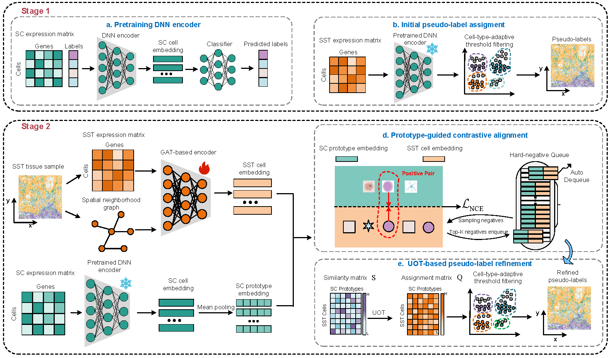

# SpatialAlign

**Prototype-anchored contrastive alignment for cell-type annotation in subcellular spatial transcriptomics.**

SpatialAlign bridges the domain gap between reference scRNA-seq and target SST data via (i) prototype-guided contrastive learning with hard-negative queues, and (ii) unbalanced optimal transport (UOT)–based iterative pseudo-label refinement. Evaluated on CosMx, MERFISH, and Xenium, it consistently outperforms existing methods while scaling to large datasets.



---

## Pipeline

| Stage | Description |
|-------|--------------|
| **Stage 1** | Pretrain a DNN on labeled scRNA-seq; assign initial pseudo-labels to SST cells |
| **Stage 2** | Learn context-aware SST embeddings with a GAT encoder; refine pseudo-labels via prototype-guided contrastive alignment + UOT |

---

## Setup

```bash
pip install -r requirements.txt
```

Key dependencies: Python 3.8+, PyTorch, PyTorch Geometric, scanpy, POT (optimal transport).

---

## Data

Example datasets are hosted externally. See [Data/Note.md](Data/Note.md) for download links and file descriptions.

| File | Role |
|------|------|
| `sc_nsclc.h5ad` | scRNA-seq reference |
| `lung9_rep1_15types.h5ad` | Spatial transcriptomics target |
| `X_umap_df.csv` | Pre-computed UMAP (optional) |

---

## Run

1. Download data and place files in `data/` (see [Data/Note.md](Data/Note.md)).
2. Run the demo notebook:

```bash
python -m jupyter notebook demo-nsclc.ipynb
```

Or use the programmatic API:

```python
from SpatialAlign import train_model, pseudoing_label, train_for_stage2

# Stage 1: pretrain DNN, align scRNA-seq and ST
adata_sc, adata_st, prototypes = train_model(
    adata_sc_path="data/sc_nsclc.h5ad",
    adata_st_path="data/lung9_rep1_15types.h5ad",
    model_save_path="output/mlp_stage1.pt",
)

# Pseudo-label inference
adata_st = pseudoing_label(adata_st, "output/mlp_stage1.pt")

# Stage 2: GAT encoder + UOT refinement
adata_st = train_for_stage2(
    mlp_stage1_path="output/mlp_stage1.pt",
    adata_sc=adata_sc,
    adata_st=adata_st,
    gat_pt_savepath="output/gat_st.pt",
    mlp_stage2_save_path="output/mlp_stage1.pt",
)
```

---

## Output

- `adata_st.obs['pseudo_label']` — cell-type annotations
- `adata_st.obs['pseudo_confidence']` — confidence scores
- Checkpoints saved under `output/` (or your configured path)

---

## Citation

> Liu, C., Long, Y., Jia, P., Zheng, R., & Li, M. (2026). *SpatialAlign: Prototype-Anchored Contrastive Alignment for Cell-Type Annotation in Subcellular Spatial Transcriptomics.* School of Computer Science and Engineering, Central South University.

For full details, see the full manuscript and supplementary materials.

---

## Repository

- [GitHub](https://github.com/1liuchunlong/SpatialAlign)
